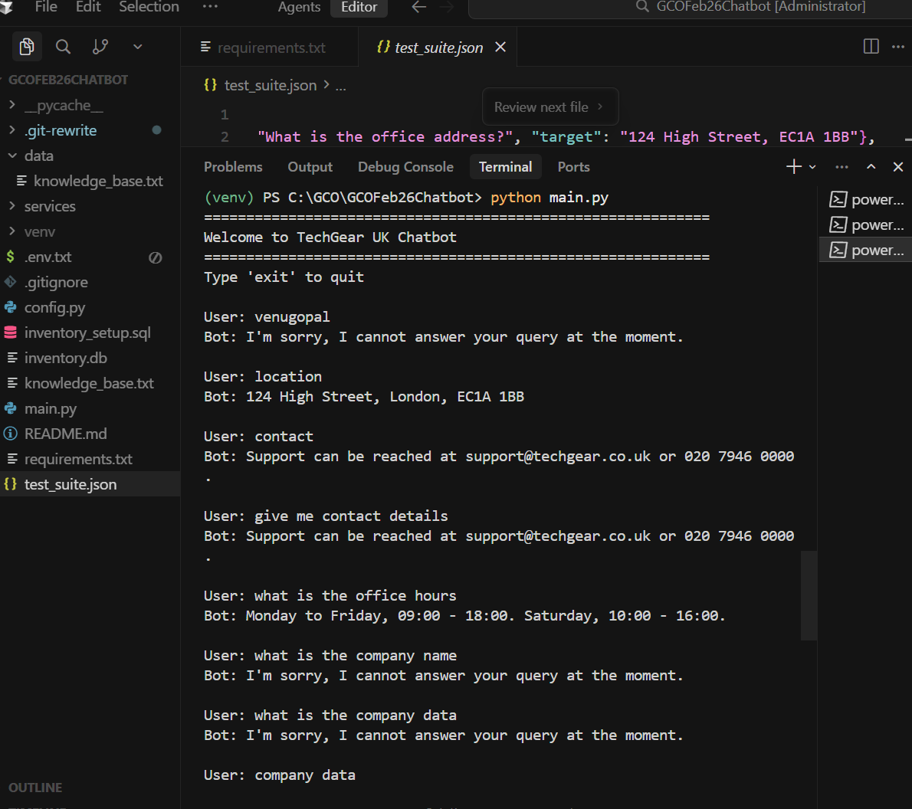

# Tri-Tier Chatbot (CLI) - TechGear UK

A production-ready intelligent console chatbot with semantic understanding, built using Python and Azure OpenAI.

## 🎯 Features

- **Three-Tier Architecture**: Knowledge Base → Database → Fallback
- **Semantic Query Understanding**: Natural language processing using Azure OpenAI
- **Intelligent Company Information**: Handles broad queries about company details
- **Inventory Management**: Real-time product availability and pricing queries
- **UK Localization**: British English with GBP currency formatting

---

## 📋 Prerequisites

- Python 3.10 or higher
- Azure OpenAI Service access with credentials
- SQLite (included with Python)

---

## 🚀 Quick Setup

### **Step 1: Clone the Repository**

```bash
git clone https://github.com/venupathange/GCOFeb26Chatbot.git
cd GCOFeb26Chatbot
```

### **Step 2: Create Virtual Environment**

```powershell
# Create virtual environment
python -m venv venv

# Activate virtual environment
.\venv\Scripts\Activate.ps1
```

**Note:** If you get an execution policy error:
```powershell
Set-ExecutionPolicy -ExecutionPolicy RemoteSigned -Scope CurrentUser
```

### **Step 3: Install Dependencies**

```powershell
pip install -r requirements.txt
```

### **Step 4: Configure Azure OpenAI Credentials**

Create a `.env` file in the project root:

```powershell
notepad .env
```

Add your Azure OpenAI credentials:

```env
AZURE_OPENAI_ENDPOINT=https://your-resource-name.openai.azure.com/
AZURE_OPENAI_KEY=your-azure-openai-key-here
AZURE_API_VERSION=2024-02-15-preview
AZURE_DEPLOYMENT_NAME=gpt-4o-mini
```

**Finding Your Azure Credentials:**
1. Go to [Azure Portal](https://portal.azure.com)
2. Navigate to your Azure OpenAI Service resource
3. Click "Keys and Endpoint" → Copy Endpoint and Key
4. Click "Model deployments" → Copy your deployment name

### **Step 5: Initialize Database**

Run the database setup script:

```powershell
python setup_database.py
```

This will:
- Create `inventory.db` from `inventory_setup.sql`
- Load 8 products with stock and pricing data
- Display sample data to verify setup

**Alternative (manual setup):**
```powershell
sqlite3 inventory.db < inventory_setup.sql
```

### **Step 6: Run the Chatbot**

```powershell
python main.py
```

---

## 💬 Usage Examples

### **Company Information Queries**

```
User: what is the company name
Bot: TechGear UK

User: tell me about techgear
Bot: TechGear UK is located at 124 High Street, London, EC1A 1BB. We are open Monday to Friday, 09:00 - 18:00. Saturday, 10:00 - 16:00. For support, contact support@techgear.co.uk or 020 7946 0000.

User: where are you located
Bot: 124 High Street, London, EC1A 1BB

User: contact details
Bot: Support can be reached at support@techgear.co.uk or 020 7946 0000.

User: office timings
Bot: Monday to Friday, 09:00 - 18:00. Saturday, 10:00 - 16:00.
```

### **Inventory Queries**

```
User: Is the Waterproof Commuter Jacket available in XL?
Bot: Yes (3 in stock)

User: What is the price of the Dry-Fit Running Tee?
Bot: £25.00

User: Do you have Tech-Knit Hoodie in size M?
Bot: 10
```

### **Fallback**

```
User: What is the capital of France?
Bot: I'm sorry, I cannot answer your query at the moment.
```

---

## 🏗️ Architecture

### **Three-Tier System**

```
User Query
    ↓
[LLM Classification]
    ↓
┌─────────────────┬──────────────────┬──────────────┐
│   TIER 1        │     TIER 2       │   TIER 3     │
│ Knowledge Base  │   Inventory DB   │   Fallback   │
│  (Semantic)     │  (Tool Calling)  │              │
└─────────────────┴──────────────────┴──────────────┘
```

### **Tier 1: Knowledge Base (Company Information)**
- Semantic query classification using Azure OpenAI
- Structured company metadata
- Handles: company name, location, hours, contact, delivery, returns

### **Tier 2: Inventory Database**
- OpenAI function/tool calling for parameter extraction
- SQLite database queries
- Handles: product availability, stock counts, pricing

### **Tier 3: Fallback**
- Default response for unrecognized queries
- Returns: "I'm sorry, I cannot answer your query at the moment."

---

## 📁 Project Structure

```
GCOFeb26Chatbot/
│
├── main.py                    # Entry point - CLI loop
├── config.py                  # Configuration settings
├── setup_database.py          # Database initialization script
├── run_tests.py               # Automated test runner
├── requirements.txt           # Python dependencies
├── .env                       # Azure OpenAI credentials (create this)
├── .gitignore                # Git ignore rules
│
├── services/
│   ├── __init__.py           # Package initializer
│   ├── router.py             # Query routing logic
│   ├── kb_service.py         # Knowledge Base service (Tier 1)
│   ├── inventory_service.py  # Inventory service (Tier 2)
│   └── llm_service.py        # Azure OpenAI integration
│
├── data/
│   └── knowledge_base.txt    # Static company data (reference)
│
├── inventory.db              # SQLite database
├── inventory_setup.sql       # Database schema
└── test_suite.json           # Test cases
```

---

## 🔧 Configuration

### **Environment Variables (.env)**

| Variable | Required | Description | Example |
|----------|----------|-------------|---------|
| `AZURE_OPENAI_ENDPOINT` | Yes | Azure OpenAI endpoint URL | `https://my-resource.openai.azure.com/` |
| `AZURE_OPENAI_KEY` | Yes | Azure OpenAI API key | `abc123...` |
| `AZURE_API_VERSION` | No | API version (default: 2024-02-15-preview) | `2024-02-15-preview` |
| `AZURE_DEPLOYMENT_NAME` | No | Model deployment name (default: gpt-4o-mini) | `gpt-4o-mini` |

### **Company Information**

To update company information, edit `services/kb_service.py`:

```python
self.company_data = {
    "company_name": "TechGear UK",
    "location": "124 High Street, London, EC1A 1BB",
    "office_hours": "Monday to Friday, 09:00 - 18:00. Saturday, 10:00 - 16:00.",
    "delivery_policy": "Standard delivery takes 3-5 working days. Next-day delivery is available for £5.99.",
    "returns": "Items can be returned within 30 days of purchase with a valid receipt.",
    "contact": "Support can be reached at support@techgear.co.uk or 020 7946 0000."
}
```

---

## 🧪 Testing

### **Automated Test Suite**

Run all 10 test cases automatically:

```powershell
python run_tests.py
```

This will:
- Load test cases from `test_suite.json`
- Run each test against the chatbot
- Display pass/fail results with detailed output
- Show success rate and failed test details

**Test Coverage:**
- **Knowledge Base (3 tests)**: Office address, opening hours, delivery pricing
- **Database (4 tests)**: Stock availability, out of stock, stock counts, pricing
- **Fallback (3 tests)**: Unrelated questions

### **Manual Testing**

```powershell
python main.py
```

Try the example queries from the Usage section above.

---

## 🐛 Troubleshooting

### **Issue: "AZURE_OPENAI_ENDPOINT environment variable not set"**

**Solution:**
1. Ensure `.env` file exists in project root
2. Check that `.env` contains your actual Azure credentials
3. Verify `python-dotenv` is installed: `pip install python-dotenv`

### **Issue: Virtual environment won't activate**

**Solution:**
```powershell
Set-ExecutionPolicy -ExecutionPolicy RemoteSigned -Scope CurrentUser
.\venv\Scripts\Activate.ps1
```

### **Issue: "Module not found: openai"**

**Solution:**
```powershell
# Ensure virtual environment is activated (see (venv) in prompt)
pip install -r requirements.txt
```

### **Issue: Database not found**

**Solution:**
```powershell
sqlite3 inventory.db < inventory_setup.sql
```

### **Issue: Company queries return fallback**

**Solution:**
- Check that `.env` has correct Azure OpenAI credentials
- Verify Azure OpenAI endpoint is accessible
- Check Azure OpenAI deployment is active

---

## 📊 Database Schema

### **product_inventory Table**

```sql
CREATE TABLE product_inventory (
    id INTEGER PRIMARY KEY AUTOINCREMENT,
    item_name TEXT NOT NULL,
    size TEXT NOT NULL,
    stock_count INTEGER NOT NULL,
    price_gbp DECIMAL(10, 2) NOT NULL
);
```

### **Sample Data**

| item_name | size | stock_count | price_gbp |
|-----------|------|-------------|-----------|
| Waterproof Commuter Jacket | S | 5 | 85.00 |
| Waterproof Commuter Jacket | M | 0 | 85.00 |
| Waterproof Commuter Jacket | L | 12 | 85.00 |
| Waterproof Commuter Jacket | XL | 3 | 85.00 |
| Tech-Knit Hoodie | M | 10 | 45.00 |
| Tech-Knit Hoodie | S | 0 | 45.00 |
| Dry-Fit Running Tee | L | 20 | 25.00 |
| Dry-Fit Running Tee | M | 15 | 25.00 |

---

## 🔒 Security

- ✅ `.env` file is automatically ignored by Git
- ✅ Never commit credentials to version control
- ✅ Use environment variables for sensitive data
- ✅ Parameterized SQL queries prevent SQL injection

---

## 🛠️ Technical Stack

- **Language**: Python 3.10+
- **LLM**: Azure OpenAI (gpt-4o-mini)
- **Database**: SQLite
- **Libraries**:
  - `openai` - Azure OpenAI Python SDK
  - `python-dotenv` - Environment variable management
  - `sqlite3` - Database operations (built-in)

---

## 📝 Key Features

### **Semantic Understanding**
- Natural language query classification
- Context-aware response generation
- Handles query variations and synonyms

### **Intelligent Routing**
- LLM-based classification (company_info/inventory/unknown)
- Automatic tier selection
- Maintains strict separation of concerns

### **Production Quality**
- Clean, modular code architecture
- Comprehensive error handling
- Type hints and docstrings
- No hardcoded paths or credentials

### **UK Localization**
- British English spelling
- GBP currency formatting (£XX.XX)
- UK-specific company information

---

## 📄 License

This project is part of the GCO Feb 26 assessment.

---

## 👥 Contributing

This is an assessment project. For questions or issues, please contact the project maintainer.

---

## 🎓 Assessment Criteria

This chatbot demonstrates:

1. ✅ **Accuracy**: Correct routing to appropriate data sources
2. ✅ **Function Calling**: Proper parameter extraction for SQL queries
3. ✅ **Clean Code**: Production-level code quality and best practices
4. ✅ **Semantic Understanding**: Natural language query processing
5. ✅ **Three-Tier Architecture**: Clear separation of concerns

---

## 📞 Support

For technical support or questions about TechGear UK:
- **Email**: support@techgear.co.uk
- **Phone**: 020 7946 0000
- **Address**: 124 High Street, London, EC1A 1BB

---

## ✨ Quick Command Reference

```powershell
# Setup
python -m venv venv
.\venv\Scripts\Activate.ps1
pip install -r requirements.txt

# Configure (edit .env with your credentials)
notepad .env

# Initialize database
python setup_database.py

# Run tests
python run_tests.py

# Run chatbot
python main.py

# Exit chatbot
Type: exit
```

---

**Built with ❤️ for GCO Feb 26 Assessment**


!